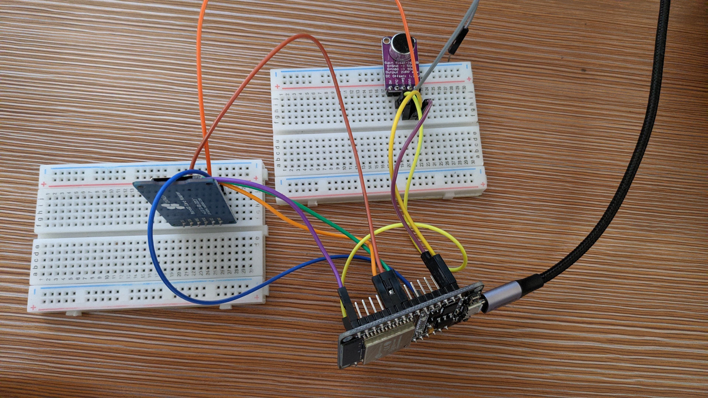

# esp32_SoundRecorder

## Prepare
- [ESP32-DevKitC](https://www.espressif.com/en/products/hardware/esp32-devkitc/overview)  : espressif
- [AE-ADMP441_K](http://akizukidenshi.com/catalog/g/gK-06864/) : Akizuki Denshi (or similar product using ADMP441)
- [AE-MICRO-SD-DIP](http://akizukidenshi.com/catalog/g/gK-05488/) : Akizuki Denshi (or similar product for micro SD slot)
- resistor 10kΩ x 4, 100kΩ x 1, capacitor 22pF x 1

## Wiring microphone with I2S interface

### Wiring MAX9814 (without I2S interface) by [ligantx](https://github.com/ligantx)

The SD card wiring is the same as above (for my sd card adapter, pullup resistors weren't necessary)

MAX9814 Wiring:
MAX9814 |   ESP32
GND - GND  
Vdd - 3V3  
Out - VP (GPIO36)  
AR - dont connect  
Gain - if it's not connected is 60dB Gain, if its connected to Gnd it's 50dB, and if it's connected to Vdd it's 40dB  

Note: if you want to change the Esp32 VP pin to another, use [this image](https://lastminuteengineers.com/wp-content/uploads/arduino/ESP32-Development-Board-Pinout.png) and change `ADC1_CHANNEL_0` in I2S.cpp file accordingly.

i used information from [this example](https://github.com/espressif/esp-idf/blob/master/examples/peripherals/i2s_adc_dac/main/app_main.c)

## Development Environment
- [Arduino IDE](https://www.arduino.cc/en/main/software)
- [arduino-esp32](https://github.com/espressif/arduino-esp32)

## How to use
Set SD card. Turn on the power. And it starts recording sound and saves as wav file (16bit, monoral, 44.1kHz) in SD card.
