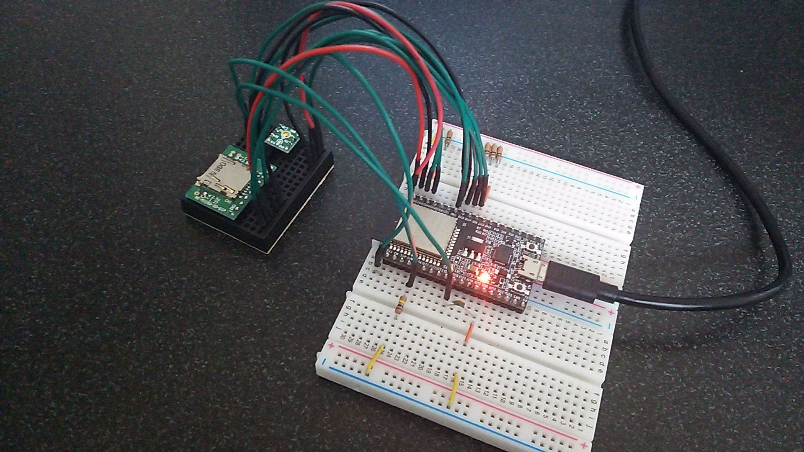

# esp32_SoundRecorder

## Prepare
- [ESP32-DevKitC](https://www.espressif.com/en/products/hardware/esp32-devkitc/overview)  : espressif
- [AE-ADMP441_K](http://akizukidenshi.com/catalog/g/gK-06864/) : Akizuki Denshi (or similar product using ADMP441)
- [AE-MICRO-SD-DIP](http://akizukidenshi.com/catalog/g/gK-05488/) : Akizuki Denshi (or similar product for micro SD slot)
- resistor 10kΩ x 4, 100kΩ x 1, capacitor 22pF x 1

## Wiring

## Development Environment
- [Arduino IDE](https://www.arduino.cc/en/main/software)
- [arduino-esp32](https://github.com/espressif/arduino-esp32)

## How to use
Set SD card. Turn on the power. And it starts recording sound and saves as wav file (16bit, monoral, 44.1kHz) in SD card.
